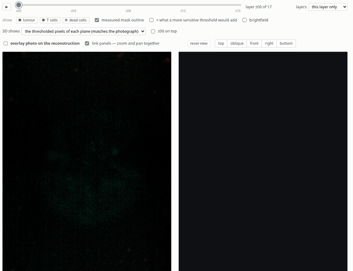
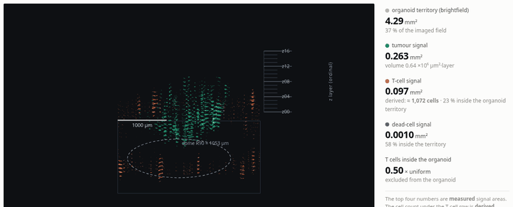

# inc_t_cell — T-cell infiltration into PDA organoids, Incucyte time-lapse

PDA 30364 tumour organoids, co-cultured with CAFs and/or macrophages, with or
without T cells, under KRAS and SRC inhibitors. Imaged on an Incucyte for four
days.

This repository turns those images into numbers, and the numbers into something
you can look at.


*One well, rebuilt one z layer at a time. Every dot is a 5.6 µm voxel above
threshold: green tumour, orange T cells, violet dead cells; the grey plate at the
bottom is the organoid footprint measured in brightfield. The dashed ring is the
radius containing 90 % of the organoid mass.*

## What the pipeline does to a photograph



*Left: the raw fluorescence plane with the measured mask outlined in each
channel's colour. Right: the same layer in the reconstruction. Moving through z
moves both, so any claim about a layer can be checked against the pixels it came
from. This page exists for one reason — a threshold is a decision, and a decision
should be visible.*

## Is the reconstruction actually in the right place?


*The same layer, with the camera locked straight down and the projection scaled so
that one voxel covers exactly the pixels it was measured from, while the raw
photograph fades in and out on top. The stain is shown **without** the mask
outline on purpose: the outline is drawn from the same mask as the voxels, so
comparing the two would be circular. What this tests is whether the voxels land on
the stain itself — and they fade in place rather than sliding across it, at every
layer. Only XY placement is testable this way; the z axis carries no micron scale
because the z step is recorded in no file.*



## Scope of the data

| | |
|---|---|
| Plate | 96 wells; **88 imaged** (column 9 was not imaged) |
| Time | 13 points, ~8 h apart, 96 h total |
| Channels | brightfield (1 plane), green, orange, NIR (17 z planes each) |
| Channel → content | green = tumour, orange = T cells, NIR = dead cells |
| Image | 1040 × 1408 px at 2.798 µm/px (Incucyte 4×) |
| Total | 59 488 TIFF files, 44 GB |

## Four directories

| directory | what it does | start here |
|---|---|---|
| **`data/inc_tests/`** | Raw data, plate map, file index. Untouched. | [`data/inc_tests/README.md`](data/inc_tests/README.md) |
| **`analysis/`** | Pixel-based measurement and six analyses, each answering one question and writing its own folder. | [`analysis/README.md`](analysis/README.md) |
| **`atlas/`** | One self-contained HTML page per well: 3D view, figures, tables, and a segmentation-check page. | [`atlas/README.md`](atlas/README.md) |
| `viewer/` | Local app for browsing the raw images with the channels overlaid. | [`viewer/README.md`](viewer/README.md) |

In a hurry: open `atlas/site/index.html`.

## Running it

Dependencies: `numpy scipy scikit-image pandas tifffile matplotlib pillow`
(plus `fastapi uvicorn` for `viewer/`).

```bash
# 1. measurement — once, ~20 min
python3 analysis/extract.py --flat
python3 analysis/extract.py --all --jobs 7

# 2. analyses — in order; a1 writes the exclusion list the others read
python3 analysis/a1_qc.py
python3 analysis/a2_infiltration.py
python3 analysis/a3_labelfree.py
python3 analysis/a4_depth.py
python3 analysis/a5_death.py
python3 analysis/a6_growth.py

# 3. atlas — 3D pages, figures, evidence pages
python3 atlas/build.py  --all --jobs 7
python3 atlas/thumbs.py --all --jobs 7
python3 atlas/check.py  --all --jobs 7
xdg-open atlas/site/index.html
```

## What this data can and cannot answer

Details are in the directory READMEs; this is the short version.

**Available.** Signal area and signal volume per channel; organoid mass from
brightfield, independent of staining; whether a population sits inside or outside
the organoid and how far from its boundary; the depth distribution; how all of
that changes over four days; and comparisons between groups.

**T-cell numbers can be estimated.** The seeding number is known (5000 per well),
which calibrates a scale of 90.8 µm² per cell. The scale passed three checks — the
important one being that it implies an equivalent cell diameter of 10.8 µm, the
real size of a T cell. These numbers are always written with `≈`.

**Tumour cell numbers cannot.** The same calculation applied to the 2000 seeded
PDA cells implies a cell smaller than a T cell, which is impossible: the green
stain misses most organoids. Tumour is reported as area and volume.

**Macrophages and CAFs cannot be located in the image.** They carry no fluorescent
label; which wells contain them is known only from the plate map.

**Absolute depth and µm³ volumes are not available.** The z step is recorded in no
file — the TIFF tags carry no optical fields and the plate XML contains no optical
entry at all. Depth is given as a layer index; volumes as `µm²·layer`, which
becomes µm³ once multiplied by the z step.

**The pixel size is unverified.** The value 2.798 µm/px was back-calculated from
the instrument's own field label (2.91 × 3.94 mm). Dimensionless measures — ratios,
enrichment, shares — do not depend on it; everything in µm and mm² does.

## Why the measurement is pixel-based rather than object-based

At 2.798 µm/px a T cell is about 2.5 pixels across. Single-cell segmentation is
not reliable at that scale: shift the threshold slightly and the object count
changes several-fold. This was measured rather than assumed — the difference in
connected-component count between wells with and without T cells is 1155 against
5000 seeded, so each component holds about 4.3 cells.

Area fractions are far more stable: scaling the threshold by 0.67 and 1.67 leaves
the rank correlation of well ordering between 0.93 and 0.98. Every headline
measure is therefore a threshold-above area, or a ratio derived from one.

## Why thresholds are not adapted per well

A per-well threshold rescales every well differently and makes wells
incomparable, so all thresholds are fixed plate-wide. The price is that the
threshold is generous in some wells and stingy in others — which is precisely why
`atlas/site/check/` exists: the raw image and the measured mask sit side by side,
and where the threshold lands can be judged by eye.
