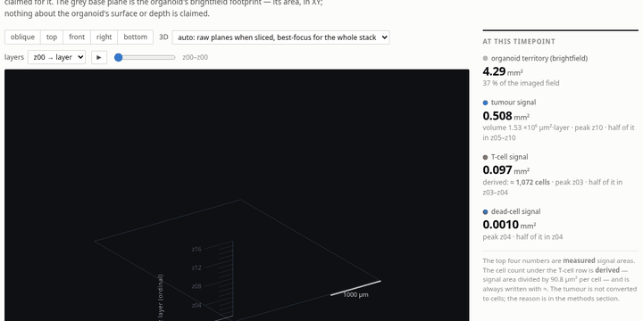
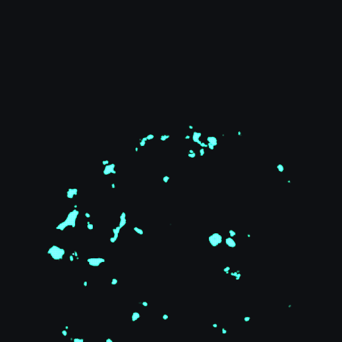

# atlas/ — 3D view, figures and evidence pages, one file per well

This directory turns the measurements into something you can open and look at.
Each well becomes a single self-contained HTML file: double-click it, no server,
no internet.



## Running it

```bash
python3 atlas/build.py  --all --jobs 7   # measure + pages       ~30 min (once)
python3 atlas/thumbs.py --all --jobs 7   # evidence thumbnails   ~15 min (once)
python3 atlas/check.py  --all --jobs 7   # segmentation pages     ~5 min
python3 atlas/build.py  --pages          # rebuild pages          seconds
xdg-open atlas/site/index.html
```

The measurement runs once and is cached under `atlas/cache/`. Changing wording, a
figure or a unit only needs `--pages`; the 30-minute measurement does not repeat.

Checks:

```bash
python3 atlas/calib.py                  # the signal-to-cell calibration and its tests
python3 atlas/palette_check.py          # colour-vision check on the channel colours
python3 atlas/selftest.py               # anything broken in the generated pages
python3 atlas/selftest.py --vs-analysis # do the numbers match the analysis/ pipeline
python3 atlas/shoot.py B04.html         # screenshot a page (headless Chrome)
python3 atlas/shoot.py B04.html --gif slice   # the animations in this README
```

## Four kinds of page

| file | what it shows |
|---|---|
| `site/index.html` | The 96-well plate, coloured by whichever measure you pick. Click a well to open it. |
| `site/<well>.html` | That well in 3D, four figures, four tables, and a methods section explaining where every number comes from. |
| `site/groups.html` | Comparisons across wells: seven figures and six statistics tables. These are the manuscript figures. |
| `site/check/<well>.html` | **Evidence.** The raw plane on the left with the measured mask outlined, the same layer in 3D on the right, moving together through z. Plus an overlay mode that proves the reconstruction sits where the stain is. |

### The overlay check



Ticking **overlay photo on the reconstruction** locks the camera straight down and
scales the projection so one voxel covers exactly the pixels it was measured from,
then blends the photograph on top with a slider. If the reconstruction were
shifted, rotated, flipped or mis-scaled, the sweep would show two offset copies of
the same pattern; instead the dots fade in place.

The photograph is shown **without** the mask outline in this mode on purpose — the
outline comes from the same mask as the voxels, so comparing the two would be
circular. The test is whether the voxels land on the stain itself. Zoom and pan
apply to both layers at once, so the check survives being examined closely.

The **layers** control decides what both sides show:

| setting | photograph | reconstruction |
|---|---|---|
| this layer only | the single raw plane | only that layer lit |
| this layer and everything below | maximum projection of planes 0…z | layers 0…z lit |

Both sides always show the same accumulation — comparing a single-plane photograph
against a multi-layer slab would break the very thing the overlay is meant to
demonstrate.

Only XY placement is testable this way. The z axis carries no micron scale, so
there is nothing to register it against.

What the sweep shows on real data: the bright cores of the stain are covered by
voxels, and the diffuse halo around each core is not — that halo is the
out-of-focus light a 4× objective spreads over neighbouring planes, and it falls
below threshold. So the overlay tests two things at once: that the reconstruction
is in the right place, and that the threshold is selecting cores rather than haze.

> A note on how this check is verified. The overlay is drawn on top of an opaque
> WebGL canvas, and the scene appends that canvas last, so without an explicit
> stacking order the photograph is hidden completely — and a comparison of "before
> and after" then shows two identical pictures, which looks like perfect
> registration and is in fact nothing at all. `atlas/shoot.py` now refuses to write
> an animation whose frames are identical, which is what caught it.

## Moving around in 3D

Blender conventions:

| | |
|---|---|
| drag | orbit |
| shift-drag or middle-drag | pan |
| scroll | zoom toward the cursor |
| double-click | reset |
| `1` `3` `7` `9` | front, right, top, bottom |

The toolbar above the scene slices the stack: build up from the bottom, peel down
from the top, or show a single layer. The play button animates it. While slicing,
a line underneath reports how much of each channel the visible slab actually
contains, so the eye is not left to guess.

None of these controls changes a measurement. Thresholds, background subtraction
and masks are fixed plate-wide in the extraction pipeline, because a threshold
that moves from well to well makes wells incomparable. What a number means is
written in the methods section, not adjusted with a slider.

## The four figures on a well page

Each answers one question:

| figure | question |
|---|---|
| 1 — signal by depth | at which z layer does each population sit |
| 2 — distance to the boundary | inside the organoid, at its rim, or outside |
| 3 — depth × distance | both at once: which depth, and how far from the edge |
| 4 — time course | how each quantity changed over four days |

Clicking a bar in Figure 1 does two things: it isolates that layer in the 3D
scene, and it puts **the actual photograph of that layer** on the page. A claim
about a layer can be checked against its pixels without leaving the page.

Every figure has a table view and an SVG download; tables download as CSV, the 3D
scene as PNG (3× resolution) or as a four-view panel. What is on screen is what
goes into the manuscript.

## Two kinds of figure, on purpose

The **group page** figures are drawn server-side with matplotlib
(`atlas/figures.py`). These are the figures that go into a paper, and readers in
this field have spent their careers reading matplotlib and R output — a figure
that looks like the ones they already read is one they can interpret without
first learning its conventions. They carry n per group, the median with its
bootstrap confidence interval, an omnibus test, and significance brackets only
where a comparison survives correction.

The **well page** figures are drawn in the browser, because they follow the time
slider. They use the same conventions.

No box plots anywhere: conditions hold 4 to 17 wells, and a box plot invents
quartiles at that size. Every well is a point.

## Cell numbers: what is claimed and what is not

This is the part that needs the most care.

**What is measured is signal area.** Everything written in mm² is the area of the
pixels above threshold — a direct measurement. A cell count is a **derived
estimate** and is written with `≈` everywhere it appears.

**Where the T-cell number comes from.** The seeding numbers are known: wells
marked for T cells received 5000. The difference in projected signal area between
those wells and matched T-cell-free wells, divided by 5000, gives **90.8 µm² per
cell**. Before using that scale it had to pass three checks:

1. It implies an equivalent cell diameter of **10.8 µm**. A T cell is 7–10 µm, and
   at 2.798 µm/px with fluorescence bloom this is the value one should get. The
   scale does not imply a biologically impossible cell.
2. The four co-culture groups reproduce it **independently**, at 84–102 µm².
3. The between-well spread is narrow (CV 20 %, 95 % CI ±9 %).

**Why the tumour is not counted in cells.** The same calculation for 2000 seeded
PDA cells gives an equivalent diameter of 8.9 µm — smaller than a T cell, which is
impossible for a tumour cell. The reason is known: the green stain misses most
organoids (a median 15 % of brightfield objects carry any green signal). This
calibration was computed and **rejected**; it is shown on the group page so the
rejection can be checked.

**Why objects are not counted.** The difference in connected-component count
between wells with and without T cells is 1155 against 5000 seeded — each
component holds about 4.3 cells at this resolution.

**The trap in per-layer counts.** The calibration is defined on the projected
(maximum-intensity) mask. Layer areas are a different quantity: they sum to 3–5×
the projected area, because the depth of field of a 4× objective is tens of
microns and one cell appears in several layers. Dividing a layer area by the same
scale would inflate the count severalfold. Per-layer cell equivalents therefore
**apportion the well total** across layers in proportion to signal, and sum
exactly to the well total. The pages and tables say so, and report the overcount
factor for that frame. Distance bands do not have this problem — they are computed
on the projected mask, so band areas sum exactly to the projected area and the
scale applies directly.

## The dome, and why most wells do not have one

The dome is fitted to the **largest connected component** of the brightfield
territory, not to the whole territory: scattered debris drags the centroid to the
middle of the frame and the radius becomes a measure of the frame rather than of
the well (1053 µm instead of 1689 µm in B04).

If the largest component holds less than half the territory, the well is
multi-organoid and "distance from the centre" is not a defined quantity; no dome
ring is drawn there. Measured: B02 97 % and B04 86 % single mass, but B01 16 % and
A01 26 %. The primary frame is therefore not the dome but the **signed distance to
the organoid boundary**, which works in both cases.

## One confound worth knowing about

Median signed distance depends on how much of the field the territory covers. When
the territory fills the frame, every point is inside it by construction and the
measure reports confluence rather than infiltration. Measured across the 27
T-cell wells, territory fraction and median distance correlate at Spearman
ρ = −0.50 (p = 0.008), and four of the six PDA+MAC wells have a territory covering
95 % of the field. Before this was caught, that group showed "deep infiltration"
at a median of −252 µm and passed BH correction at q = 0.049. It was an artefact.

Figure 3 on the group page now excludes wells whose territory covers more than
70 % of the field, and states the correlation and the excluded wells in its
caption. Enrichment (Figure 1) is unaffected — it is a density ratio and does not
carry this dependence.

## Units

| quantity | unit | what it rests on |
|---|---|---|
| enrichment, shares, ratios, AUC, Cliff's δ | dimensionless | **nothing** |
| pixel and voxel counts | count | **nothing** |
| area (mm², µm²), distance (µm) | µm-derived | 2.798 µm/px — from the instrument's field label, **not verified** |
| ≈ T-cell number | cells | the calibration above |
| signal volume | µm²·layer | × the z step gives µm³ |
| depth | z layer index | the z step is in no file |

`INC_UM_PER_PX=... python3 atlas/build.py --pages` changes the pixel size without
repeating the measurement.

### The z step is genuinely absent

The TIFF tags carry no optical field at all (`XResolution` is a constant 72 dpi
placeholder; there is nothing beyond `Software`). The plate XML contains **zero**
occurrences of *z*, *step*, *objective*, *plane*, *focus* or *micron* — it records
only well contents and seeding densities.

So the XY axes in the 3D scene are metric and carry a scale bar, while the **z
axis is ordinal**: layers are drawn evenly spaced, labelled by index, with no
micron claim. The z axis deliberately carries no scale bar — the asymmetry is the
point. Note also that z00 is not an absolute height: focus is set per well, so
compare the *shape* of a depth distribution between wells, not the layer number.

If the value turns up in the acquisition protocol, one multiplication converts
every volume to µm³.

## The channel colours were checked

The conventional green/orange/red fluorescence triple is not used. Measured: for a
red-blind reader green and orange separate by ΔE 3.2 against a floor of 6.0, and
orange and red separate by only ΔE 7.1 even in normal vision, against a floor of
15.0. About 8 % of male readers could not tell the tumour from the T cells. The
triple used here passes every threshold in both light and dark
(`python3 atlas/palette_check.py`). Colour is still never the only carrier: every
series is directly labelled and every figure has a table.

## Files

| | |
|---|---|
| `calib.py` | the signal-to-cell calibration, its validation tests, and the rejected alternatives |
| `measure.py` | the 3D measurement per well × timepoint; thresholds taken verbatim from `analysis/extract.py` |
| `build.py` | runs the measurement, derives the reported quantities, writes the pages |
| `groups.py` | across-well comparison and statistics |
| `figures.py` | the matplotlib figures for the group page |
| `check.py` | full-resolution segmentation evidence pages |
| `thumbs.py` | the evidence thumbnails embedded in each well page |
| `page.py` | HTML generation — no number is computed here, only layout and wording |
| `theme.py`, `palette_check.py` | colours, and the colour-vision check |
| `selftest.py` | checks the generated pages, and the measurement against `analysis/` |
| `shoot.py` | headless screenshots and the README animations |
| `templates/` | `app.css`, `scene.js` (WebGL), `figs.js`, `groups.js`, `well.js`, `check.js`, `index.js` |
| `cache/` | measurement and thumbnail cache — deletable, regenerated |
| `site/` | output |

### Relationship to `analysis/`

Thresholds, the brightfield mask and the band edges are taken verbatim from
`analysis/extract.py`, so the numbers here use the same definitions as the
analyses in `analysis/out/`. `selftest.py --vs-analysis` checks this on every run:
across all 1144 well × timepoint samples, area fraction, territory and enrichment
must be identical. That check caught a real bug once — enrichment was being
computed after the ratio had been rounded, which produced relative errors above
60 % at small ratios.

The atlas does not replace those analyses. They do plate-wide comparison and
statistics; the atlas opens one well in space and produces the figures in a form
that can go into a manuscript.

## What this atlas cannot answer

- **Where the macrophages and CAFs are.** No fluorescent label; indistinguishable
  from tumour cells in the image. Which wells contain them is known only from the
  plate map.
- **Tumour cell numbers.** See above.
- **Absolute depth and µm³ volumes.** The z step is not recorded.
- **Fine 3D structure.** At 4× (NA ≈ 0.13) the axial resolution is low; expect
  depth slabs. Every plane carries out-of-focus haze and no deconvolution is
  applied.
